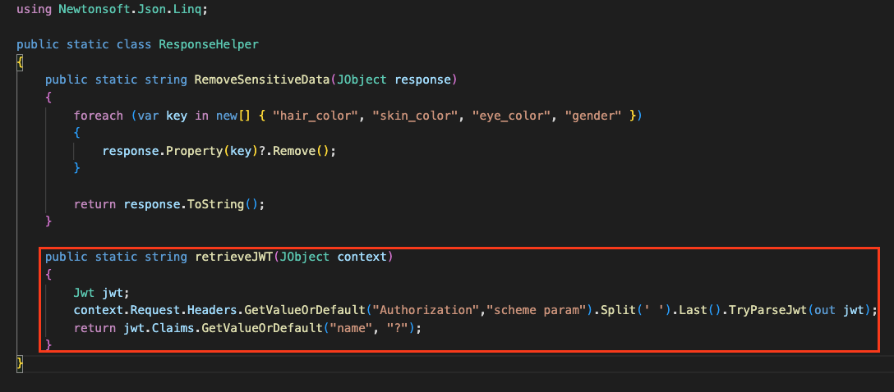
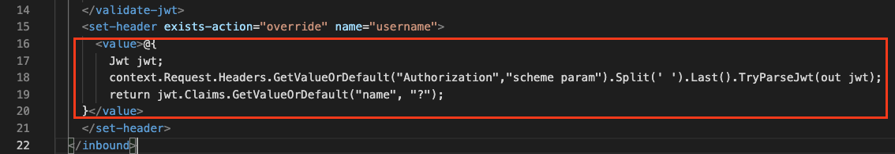

# Project Combiner
This project is created to help with the debugging process of Azure API Management policies. It enables you to write the c# code in your `c#` file and reference the code location in your policy `xml` file. After fully tested the c# code, you can run combiner for to generate a fully working policy file for you.

## Local set up
- Node JS v19.0.0
- Yarn 1.22.19

### Build
```
yarn build
```

### Run
```
yarn start
```

## How to use 

### Policy file
```
<value>@{../source/auth.cs retrieveJWT}</value>
```

In the <value> section where you normally put the original c# code, put in the file location/name and method name separated by a space.

### c# file


### Result policy file


## TODO
- Make copy and paste function to move the c# file from its compliable environment to the source folder
- 

